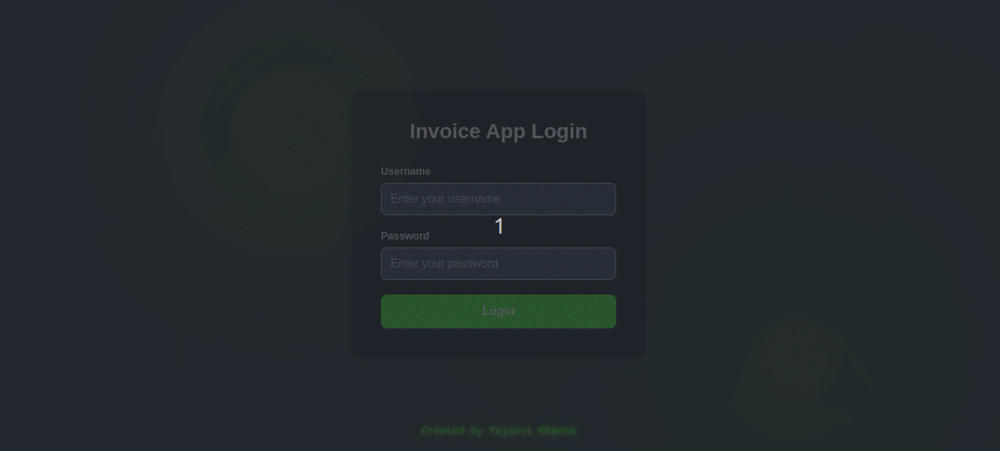

```markdown
# 🧾 Invoice Form App

A simple invoice form app built with **React**, **Formik**, **Yup**, and **React Router**, designed for creating and previewing invoices in PDF format. This project supports user authentication (via localStorage) and persistent data storage across sessions.

## 🌐 Live Demo

Check out the live app here:  
👉 [Invoice Form App on Vercel](https://edstruments-assessment-2z2edk8ht-yajasvi-khannas-projects.vercel.app)


---

## 📁 Project Structure

```
invoice-form-app/
│
├── public/               # Static assets
│
├── src/
│   ├── components/       # React components
│   │   ├── LoginPage.jsx     # Login page component
│   │   └── InvoiceForm.jsx   # Invoice form and preview
│   ├── App.jsx           # Main app routing logic
│   ├── App.css           # Basic styles
│   └── main.jsx          # ReactDOM entry point
│
├── .eslintrc.cjs         # ESLint config
├── package.json          # Project metadata and dependencies
├── vite.config.js        # Vite build tool config
├── vercel.json           # Vercel rewrites for SPA support
└── README.md             # Project documentation
```

---

## 🚀 Features

- ✅ Login page with form validation (Formik + Yup)
- ✅ Invoice creation and preview
- ✅ Download PDF invoice using `@react-pdf/renderer`
- ✅ Client-side routing (React Router v6+)
- ✅ State persistence via `localStorage`
- ✅ Responsive and styled using `styled-components`

---

## 🛠️ Getting Started

### 1. Clone the Repository

```bash
git clone https://github.com/your-username/invoice-form-app.git
cd invoice-form-app
```

### 2. Install Dependencies

```bash
npm install
```

### 3. Start Development Server

```bash
npm run dev
```

The app will be available at `http://localhost:5173`.

---

## 🧠 How Authentication & Persistence Works

- When a user logs in, their data is saved in `localStorage` as `userData`.
- On reload, the app checks `localStorage` and keeps the user logged in.
- Invoice data is also saved in `localStorage` under the key `invoiceData`.
- Logout clears both values from `localStorage`.

---

## 🧾 Building for Production

```bash
npm run build
```

This creates a production-ready build in the `dist/` folder.

### Preview the Production Build Locally:

```bash
npm run preview
```

---

## ⚙️ Vercel Deployment Guide

This app is a **Single Page Application (SPA)** using **React Router**, so special handling is required to avoid 404s when refreshing routes like `/invoice`.

### ✅ Steps:

1. **Add a `vercel.json` file to the root of your project:**

```json
{
  "rewrites": [
    { "source": "/(.*)", "destination": "/" }
  ]
}
```

2. **Push your changes and deploy via [Vercel](https://vercel.com/).**

This ensures that all route reloads (`/invoice`, `/login`) are served via `index.html`, and React Router takes over client-side navigation.

---

## 📦 Scripts

| Script         | Description                      |
|----------------|----------------------------------|
| `npm run dev`  | Start the Vite dev server        |
| `npm run build`| Build for production             |
| `npm run preview` | Preview production build     |
| `npm run lint` | Run ESLint checks                |

---

## 🧰 Built With

- [React](https://react.dev/)
- [Formik](https://formik.org/)
- [Yup](https://github.com/jquense/yup)
- [React Router DOM](https://reactrouter.com/)
- [@react-pdf/renderer](https://react-pdf.org/)
- [Vite](https://vitejs.dev/)
- [Styled Components](https://styled-components.com/)

---

## 📄 License

This project is for educational purposes only.

---

## 👤 Author

**Yajasvi Khanna**  
Made with 💻 and ☕
